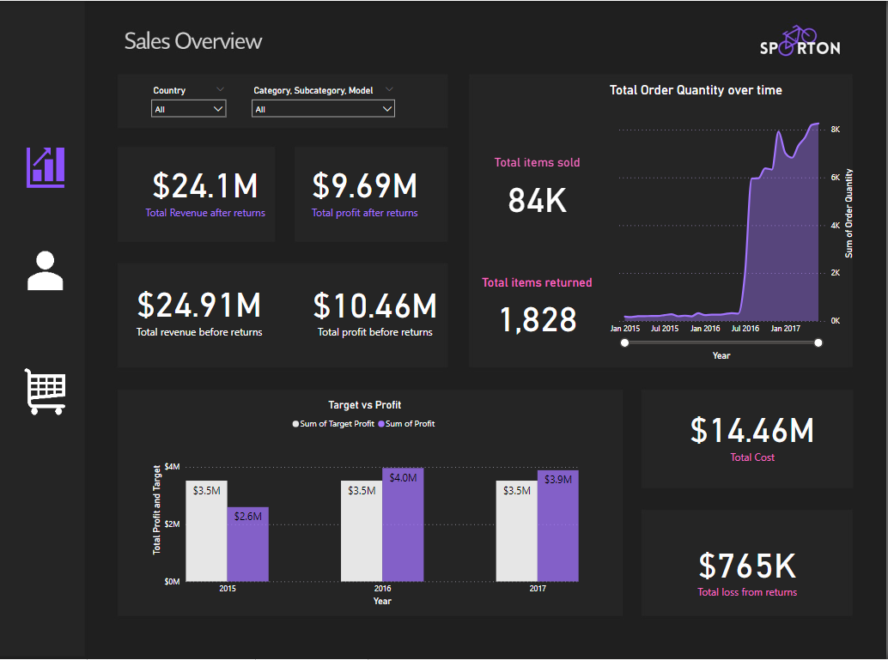
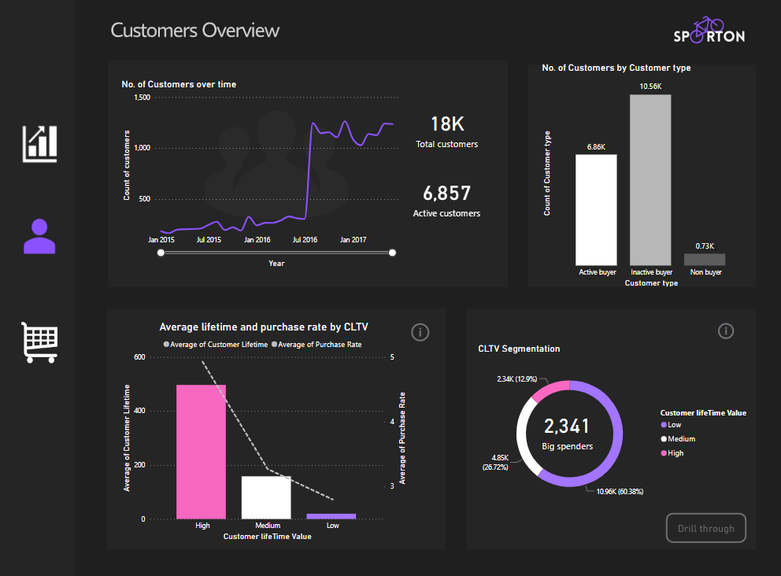
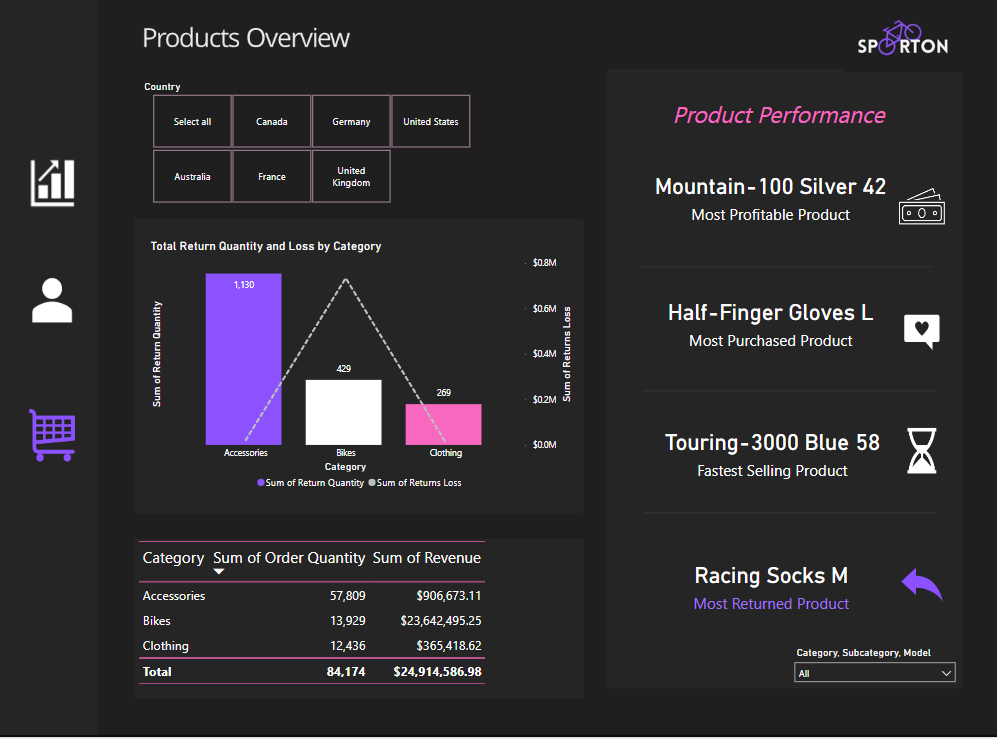

# Power BI Dashboard - Sporton

I built an end-to-end BI project for a sports and bikes company called Sporton!
I made sure to include beautiful and easy-to-understand visualizations, clear insights, clickable buttons, and responsiveness. 
I made use of SQL Server and SSMS to build the database and DAX to create new measures from the data provided.

The link to the live project is not available for people outside my firm but I took screenshots!

Thanks for visiting my project :)
